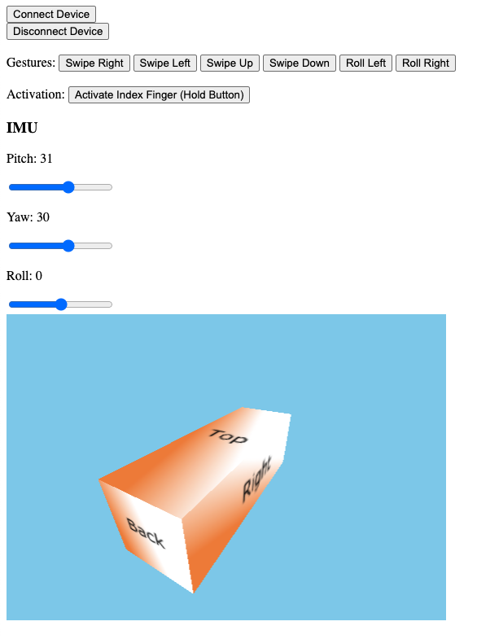

# Pison SDK Challenge
**We’d like you to build a demo experience using Pison’s technology!** 

You can build whatever you want, as long as it makes use of our SDK. You will have a week to complete this task, but we do not expect for you to spend the full week on it - we’ve seen great submissions completed in less than half a day.

Examples of good submissions:
* Android application that lets you control media playback with Pison gestures.
* Control IOT devices by forwarding Pison data to [IFTTT](https://ifttt.com/)
* Inject Pison control into a JavaScript based game.

## How to use this repo
This repo is yours! Push whatever you'd like. Reach out to guy@pison.com immediately if you have trouble accessing anything.

### Setting up the virtual Pison Device
As you hopefully know by now, we make a wearable device that - when paired with our proprietary classification algorithms - allows software developers like you build applications that leverage custom gestures from your users.

Unfortunately, we are not yet able to send a physical device to candidates! Instead, we have provided a software-based virtualization of the hardware. The SDK cannot tell the difference between a real and virtual device, so any experience that you build here will work with the real hardware.

Here's how to use it:
1. Ensure you have Java installed on your development machine, and that you can run it from the command line.
2. From a terminal window, navigate to this directory.
3. Run the command `java -jar MockPisonServer-1.0-SNAPSHOT.jar`. This file is a Java executable.
4. Check the terminal output. If the application has started correctly, you should see something like:
```
Server port: 8090
Server address: [your IP address]

http://[your IP address]:8090/mock_device_control.html
```
You may have guessed it by now, but the virtual Pison Device is just a simple web server. If the default port number doesn't work for you, you can specify a port number as a command line argument:
`java -jar MockPisonServer-1.0-SNAPSHOT.jar [other port #]`

5. Assuming everything is working, open the URL provided in a browser window. This will bring you to the virtual device's control UI. It should look something like this:



The UI works like this:
* Clicking `Connect Device` simulates a user powering on and connecting their device.
* Clicking `Disconnect Device` simulates a user powering off their device.
* Clicking any of the buttons next to `Gestures` simulates a user performing that gesture. The gesture event is sent when the button is _released_.
* Clicking and _holding_ the `Activate Index Finger` button simulates a user activating (lifting) their index finger. Releasing the button simulates the user relaxing their index finger.
* Dragging the IMU sliders simulates a user re-orienting their forearm. The 3D visualizer below should give you an indication of what the user's arm would look like. The `Back` face of the cube represents the user's elbow, the `Front` face represents their wrist.

## Hooking up the SDK

Now you're ready to use Pison data in your own application!
Platform specific instructions:
* [Android](./PisonSdkAndroidSkeleton)
